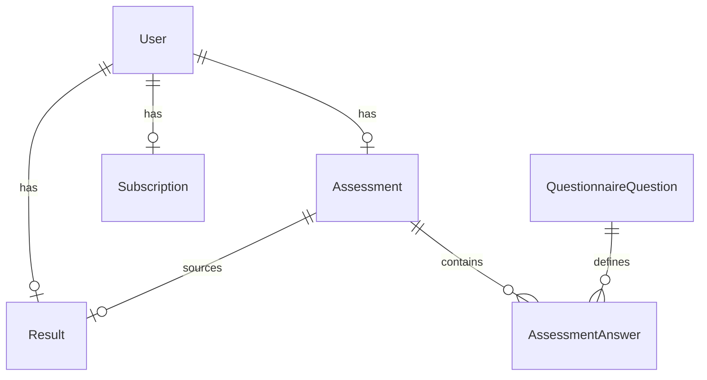

# VitalPath

[](https://github.com/Brandoo110/vitalpath/actions/workflows/ci.yml)

VitalPath 是一个匿名健康测评 funnel：分步保存与恢复、服务端 `wellness-v2` 健康计算、结果版本一致性、模拟订阅和免费/会员字段权限。仓库为独立 Git 项目，当前只完成本地代码与验证，尚未部署。

- GitHub：<https://github.com/Brandoo110/vitalpath>
- 线上 URL：待部署；不存在可引用的线上 session。
- 技术栈：Next.js 16.2.9 App Router、TypeScript、Prisma 7.8、PostgreSQL、Zod 4、Vitest 4。

## 本地运行

复制 `.env.example` 为 `.env`，让 `DATABASE_URL` 和 `DIRECT_URL` 指向同一个本地 PostgreSQL 数据库，然后运行：

```sh
npm ci
npx prisma generate
npx prisma migrate deploy
npm test -- --maxWorkers=1
npm run lint
npm run build
npm run test:migration
npm run test:http
npm run test:http:failure-cleanup
npm run verify:all
```

开发时也可以运行 `npm run dev`，然后访问 `http://localhost:3000`。API smoke 使用 `BASE_URL` 作为 cURL 前缀，例如 `BASE_URL=http://localhost:3000`；本仓库没有线上 BASE_URL。`test:http` 会选择空闲端口，直接启动本仓库的 production Next 服务，通过真实 HTTP 跑完整流程，最后只删除本次创建的 session；失败清理脚本会验证异常退出也删除 session。`verify:all` 是 CI 使用的单一完整入口，要求隔离 PostgreSQL 已初始化、Prisma client 已生成，并在浏览器两项前先安装 Chromium（`npx playwright install chromium` 或 CI 的 `--with-deps`）。`test:browser` 使用单 worker Chromium；它跑真实 Next + PostgreSQL funnel、刷新恢复、统一套餐、支付后读取失败重试、真实 stale/算法过期恢复、冲突保护和三类 CTA；`test:browser:failure-cleanup` 还验证可控失败后的 session、端口、浏览器和服务进程清理。当前后端隔离 worktree 尚未执行浏览器 smoke，等待父级完成前端接线后再运行；这不构成浏览器通过证据。不要把测试连接到生产数据库。

## 数据模型



`Assessment.version` 是保存和提交的并发门禁；`Assessment.wellnessEligible` 只有用户明确确认适用性时才为 `true`，历史数据保持 `NULL`。`Result.assessmentId` 与 `sourceAssessmentVersion` 绑定产生它的测评快照，`algorithmVersion` 升级后旧结果失效；`targetDate` 和 `calculationDetails` 可空以保留未投影和历史结果。`Subscription.status` 是订阅唯一来源，API 为兼容性仍返回 `subscriptionStatus`。

固定问卷元数据由历史 migration seed，扩展题当前全部可选；`active`、`required` 和 `valueType` 是固定定义的一致性校验字段，其中 `required` 不驱动动态提交校验，提交只校验固定核心健康字段。`valueType` 描述答案列类型（text/number/boolean/single_choice/multi_choice）；数据库 migration 只约束答案恰好一个非空值。应用层在写入和读取时再校验固定题目定义、active/required/valueType、实际列、有限数值范围和枚举，因此错误历史行会返回结构化 `422 assessment_invalid`，不会静默跳过或生成部分结果。本次 schema migration 会保留旧题目和历史答案，不在运行时静默重写 seed。

## API

所有写接口使用 JSON；`sessionId` 必须是 UUID。`PATCH /api/assessment` 和 `POST /api/assessment/submit` 都必须携带当前整数 `version`。

### `POST /api/sessions`

请求：`{ "healthDataConsent": true }`（可省略）。响应 `201`：`{ "sessionId": "…", "subscriptionStatus": "free" }`。

### `GET /api/assessment?sessionId=…`

响应带 `Cache-Control: private, no-store`，返回保存的核心字段、扩展答案、`step`、`completed`、当前 `version`，以及恢复状态：`nextStep`、`missingFields` 和 `state`（`empty`、`draft`、`completed` 或 `stale`）。没有测评时的形状是：

```json
{
  "assessment": null,
  "version": 0,
  "nextStep": 1,
  "missingFields": ["gender", "goal", "age"],
  "state": "empty"
}
```

`step` 只是客户端恢复游标，不是完成证明；提交资格由服务端必填核心字段和当前 version 决定。匿名 `sessionId` 是本地演示用的 bearer 身份，没有登录或生产级认证语义；服务端仍会拒绝格式错误或未知 session，调用方不得把它当作可公开分享的生产凭证。

### `PATCH /api/assessment`

请求示例：

```json
{
  "sessionId": "…",
  "step": 2,
  "version": 1,
  "data": { "weightKg": 72, "targetWeightKg": 62 }
}
```

成功响应包含递增后的 `version`、`nextStep`、`missingFields`、`state`、`step` 和 `completed`。例如：

```json
{
  "version": 2,
  "step": 2,
  "completed": false,
  "nextStep": 3,
  "missingFields": ["heightCm", "weightKg", "targetWeightKg"],
  "state": "draft"
}
```

同一测评行在事务中锁定；旧版本返回 `409 version_conflict`，不会覆盖新值。相同语义字段的 no-op 保存保持 `version`、结果和 `completed` 不变；只提高 `step` 的 step-only 保存只推进恢复游标，不使报告过期；核心字段、扩展答案或同意状态真实变化会递增 `version`、把 `completed` 置为 `false` 并使旧报告进入 `stale`。所有写入在同一事务中完成。提交和 PATCH 都必须使用服务端最近一次返回的 version，旧 version 没有绕过方式。

### `POST /api/assessment/submit`

请求：`{ "sessionId": "…", "version": 2 }`。成功响应：`{ "ok": true, "resultId": "…" }`。服务器在锁定的测评快照上计算，并持久化 `calculatedAt`、`algorithmVersion`、`calculationDetails` 和来源版本。`healthDataConsent` 与 `wellnessEligible` 未明确为 `true`、目标方向或支持域不符合时返回 `422 assessment_invalid`，响应带字段化 `issues`、`nextStep` 和 `nextAction`，不创建或覆盖结果；缺少核心字段时保留 `missingFields` 并返回相同结构化定位信息。同版本重复提交返回原结果，不刷新日期；版本已变化返回 `409 version_conflict`。首次支付可以先于 submit，但只有 submit 成功后结果接口才有可读取报告；支付不会绕过 consent、支持域或算法校验。算法依据见 [docs/health-algorithm.md](docs/health-algorithm.md)。

### `GET /api/results?sessionId=…`

响应带 `Cache-Control: private, no-store`。没有结果返回 `409 assessment_not_submitted`；测评修改或算法版本过期时返回 `409 assessment_stale`。免费响应只含 BMI、分类、宽泛热量区间和 plan preview，绝不含精确 `recommendedCalories`、`targetDate` 或 `calculationDetails`；两种权限均返回公共 `report` metadata，免费响应的 `lockedFields` 明确列出受保护字段，会员响应的 `lockedFields` 为空。会员响应由 `Subscription.status=active` 授权，并返回可空 `targetDate` 和完整 `calculationDetails`。

### `POST /api/pay`

请求：`{ "sessionId": "…", "plan": "monthly" }`，套餐为 `trial`、`monthly` 或 `quarterly`，`plan` 可省略（默认首次支付 `monthly`）。这是模拟支付，不连接 Stripe。

```sh
curl -X POST "$BASE_URL/api/pay" \
  -H 'content-type: application/json' \
  -d '{"sessionId":"YOUR_SESSION_ID","plan":"monthly"}'
```

首次支付写入 `Subscription(status, plan, paidAt)`。相同套餐或省略套餐的重放返回原 `paidAt`；不同套餐返回 `409 plan_conflict`，不会覆盖已有支付状态。

### `PATCH /api/sessions/lead`

请求 `{ "sessionId": "…", "name": "Plan Reader", "email": "reader@example.com" }`，用于结果生成后保存 lead 信息。

## 测试覆盖

Vitest 的 API 集成测试使用隔离 PostgreSQL，纯算法测试不依赖数据库；全量验证结果见 CI。测试重点覆盖 Mifflin/支持域、BMI 原始边界、目标方向、适用性确认、热量门槛、365 天投影、等重塑形、分步保存/恢复、乱序 step、真实数据库锁屏障下的首次创建/submit 与 PATCH/submit 顺序、同版本重复 submit 稳定性、修改后的 stale 结果、错误列/错误枚举/题目定义漂移、免费字段保护、支付重放与套餐冲突、事务回滚和数据库约束。`npm run test:migration` 会在同一专属 PostgreSQL 实例创建临时库，验证最新迁移保留旧用户/测评/答案/结果/订阅、历史 `wellnessEligible=NULL` 与 v1 来源语义、v2 可空结果列，以及订阅冲突、孤立结果、非法数值、完成态缺字段、多值答案的失败回滚。`npm run test:http` 只在本次 Next 子进程输出 Ready 后发请求，并覆盖创建→增量保存→恢复→submit→免费结果→pay→完整结果；`npm run test:http:failure-cleanup` 还验证异常退出后的本次进程组、端口和 session 清理，以及端口占用时不向 dummy 服务发业务请求。`npm run test:browser` 是单 worker 真浏览器回归，不用 mock handler 代替 UI 证据。

未覆盖真实登录、真实支付 webhook、生产数据库迁移、压力/长稳、线上部署和临床有效性；这些超出本次模拟挑战授权与范围。

算法 focused 回归还运行 3,240 个 wellness-v2 产品域组合，并用测试专用的闭式数学 oracle 对 REE、TDEE、热量策略、投影日和 365 天截断做交叉校验；同时覆盖数值/BMI 边界、无效枚举、适用性确认、目标方向和 UTC 日期边界。它使用代表性离散样本，不替代连续域穷举或临床验证。运行方式：

```sh
npm test -- --maxWorkers=1 lib/health.test.ts tests/health-v2.test.ts tests/health-domain.test.ts
```

## 需求映射与行为边界

四阶段后端完善保持 wellness-v2 数值公式不变。实现与边界如下：

| 阶段需求 | 主要风险 | 对应文件/命令 | 未覆盖原因 |
| --- | --- | --- | --- |
| 保存/恢复、no-op、step-only、真实变化 | 旧 version 覆盖新草稿，恢复状态误导提交 | `lib/assessment-progress.ts`、`app/api/assessment/route.ts`、`npm run verify` | 当前 worktree 未接入最终前端，浏览器恢复流程待父级接线后验证 |
| consent、结构化问题、结果归属和迁移保留 | 未确认数据进入算法，跨用户结果被读取，迁移半写 | submit/errors 路由、`prisma/schema.prisma`、`prisma/migrations/`、`npm run test:migration` | 未连接生产数据库，也未执行部署回滚或线上迁移 |
| 报告脱敏、先支付、套餐冲突和响应丢失重放 | 免费泄露精确字段，支付重放改变 paidAt，支付后读失败丢状态 | results/pay 路由、`scripts/http-smoke.mjs`、`npm run test:http`、`npm run test:http:failure-cleanup` | 没有真实支付 provider、webhook 或登录身份 |
| 单 worker 验证、CI 和真实浏览器清理 | 本地与 CI 命令漂移，失败遗留浏览器/服务进程 | `package.json`、`.github/workflows/ci.yml`、`scripts/browser-smoke*.mjs`、`npm run verify:all` | 本轮后端 worktree 等待父级前端集成，浏览器命令暂未声称通过 |

扩展问卷仍为可选项；真实登录、支付、临床模型、压力/长稳和线上部署保持在范围外。

## AI 使用复盘

详见 [AI使用复盘.md](AI使用复盘.md)。本轮记录了竞品数据流、数据库建模、Mock/边界测试、健康算法和支付/事务方案的协作过程，以及一次明确否决 AI 方案的原因。
