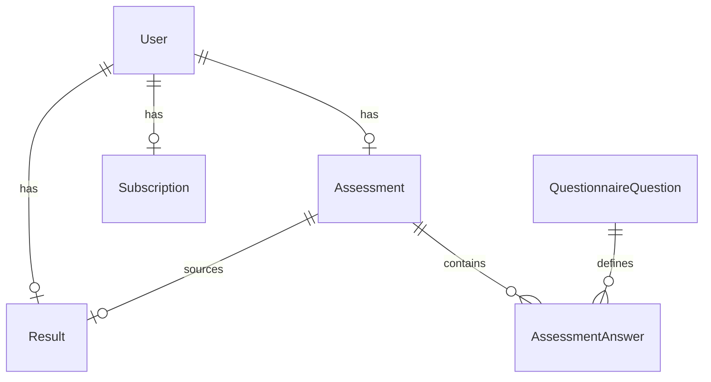

# VitalPath

[](https://github.com/Brandoo110/vitalpath/actions/workflows/ci.yml)

VitalPath 是一个匿名健康测评 funnel：分步保存与恢复、服务端 `wellness-v2` 健康计算、结果版本一致性、模拟订阅和免费/会员字段权限。仓库为独立 Git 项目，已部署到 Vercel，数据保存在独立 Supabase PostgreSQL 项目中。

- GitHub：<https://github.com/Brandoo110/vitalpath>
- 线上 URL：[https://vitalpath-pi.vercel.app](https://vitalpath-pi.vercel.app)
- 部署与密码轮换：[DEPLOYMENT.md](DEPLOYMENT.md)。
- 技术栈：Next.js 16.2.9 App Router、TypeScript、Prisma 7.8、PostgreSQL、Zod 4、Vitest 4。

## 线上演示与验收

打开 [VitalPath](https://vitalpath-pi.vercel.app) 即可从头填写测评。支付按钮只模拟订阅状态变化，不收取真实费用。

以下 session 均是专门创建的合成数据，已于 2026-09-30 验证：

| 状态 | sessionId |
| --- | --- |
| 已支付（monthly） | `85034c26-e5c6-4a31-9ef5-95cbe2fc34ff` |
| 免费对照 | `ecf3b023-b5ff-4f5b-b7af-99f8a9287d2b` |

无需登录即可通过结果 API 对照两种返回：

```sh
BASE_URL=https://vitalpath-pi.vercel.app

# 免费：只有 BMI、热量区间、建议预览
curl -sS "$BASE_URL/api/results?sessionId=ecf3b023-b5ff-4f5b-b7af-99f8a9287d2b"

# 已支付：精确摄入量、目标日期、计算明细和完整计划
curl -sS "$BASE_URL/api/results?sessionId=85034c26-e5c6-4a31-9ef5-95cbe2fc34ff"

# 重放同一模拟支付；保持首次 paidAt，不重复创建订阅
curl -sS -X POST "$BASE_URL/api/pay" \
  -H 'content-type: application/json' \
  -d '{"sessionId":"85034c26-e5c6-4a31-9ef5-95cbe2fc34ff","plan":"monthly"}'
```

如需观察免费 → 已支付的变化，从首页创建自己的演示 session，或将上面支付请求的 sessionId 改为免费对照 ID，再读取结果。公开示例可被任何访问者解锁或修改，因此不能保证免费对照永远保持免费；请勿填入真实个人资料。

本次验收：

- [PR #5 CI](https://github.com/Brandoo110/vitalpath/actions/runs/36688157900)和[对应 main CI](https://github.com/Brandoo110/vitalpath/actions/runs/36688664146)通过：106 测试 / 12 文件、lint、类型、build、隔离迁移、HTTP/浏览器与失败清理。
- 新 Supabase 实际应用全部 10 个迁移，读回 7 张表（含迁移记录表）RLS 开启、8 条问卷定义；Data API 关闭。
- 公网 API 验证分步恢复、非法数值拒绝、旧版本冲突、重复提交、免费字段保护、支付解锁及 paidAt 重放稳定；随后通过数据库读回确认报告来源版本和订阅状态一致。
- 真实 Chrome 完成 10 步填写、中途刷新继续、可选步骤跳过、免费报告、模拟支付、七天计划展开，以及刷新后的会员报告恢复。

这是挑战演示环境。上述证据说明当前流程可用，不代表临床有效性、压力容量或持续生产运行已经验证。

## 本地运行

复制 `.env.example` 为 `.env`，让 `DATABASE_URL` 和 `DIRECT_URL` 指向同一个本地 PostgreSQL 数据库，然后运行：

```sh
npm ci
npx prisma generate
npx prisma migrate deploy
npx playwright install chromium
npm run verify:all
```

开发时也可以运行 `npm run dev`，然后访问 `http://localhost:3000`。文档中的 cURL 使用 `BASE_URL` 前缀，本地为 `http://localhost:3000`，公网为 `https://vitalpath-pi.vercel.app`。`test:http` 会选择空闲端口，直接启动本仓库的 production Next 服务，通过真实 HTTP 跑完整流程，最后只删除本次创建的 session；失败清理脚本会验证异常退出也删除 session。`verify:all` 是 CI 使用的单一完整入口，要求隔离 PostgreSQL 已初始化、Prisma client 已生成，并在浏览器两项前先安装 Chromium（`npx playwright install chromium` 或 CI 的 `--with-deps`）。`test:browser` 使用单 worker Chromium；它跑真实 Next + PostgreSQL funnel、刷新恢复、统一套餐、支付后读取失败重试、真实 stale/算法过期恢复、冲突保护、编辑取消、丢响应重放、可选步骤跳过、422 修正和三类 CTA；`test:browser:failure-cleanup` 还验证可控失败后的 session、端口、浏览器和服务进程清理。当前候选已在本机隔离数据库上运行这两项浏览器命令；不要把测试连接到生产数据库。

## 数据模型



`Assessment.version` 是保存和提交的并发门禁；`Assessment.wellnessEligible` 只有用户明确确认适用性时才为 `true`，历史数据保持 `NULL`。`Result.assessmentId` 与 `sourceAssessmentVersion` 绑定产生它的测评快照，`algorithmVersion` 升级后旧结果失效；`targetDate` 和 `calculationDetails` 可空以保留未投影和历史结果。`Subscription.status` 是订阅唯一来源，API 为兼容性仍返回 `subscriptionStatus`。

固定问卷元数据由历史 migration seed，扩展题当前全部可选；`active`、`required` 和 `valueType` 是固定定义的一致性校验字段，其中 `required` 不驱动动态提交校验，提交只校验固定核心健康字段。`valueType` 描述答案列类型（text/number/boolean/single_choice/multi_choice）；数据库 migration 只约束答案恰好一个非空值。应用层在写入和读取时再校验固定题目定义、active/required/valueType、实际列、有限数值范围和枚举，因此错误历史行会返回结构化 `422 assessment_invalid`，不会静默跳过或生成部分结果。本次 schema migration 会保留旧题目和历史答案，不在运行时静默重写 seed。

## API

所有写接口使用 JSON；`sessionId` 必须是 UUID。`PATCH /api/assessment` 和 `POST /api/assessment/submit` 都必须携带当前整数 `version`。

### `POST /api/sessions`

请求：`{ "healthDataConsent": true }`（可省略）。响应 `201`：`{ "sessionId": "…", "subscriptionStatus": "free" }`。

### `GET /api/assessment?sessionId=…`

响应带 `Cache-Control: private, no-store`，返回保存的核心字段、扩展答案、`step`、`completed`、当前 `version`，以及恢复状态：`nextStep`、`missingFields` 和 `state`（`empty`、`draft`、`completed` 或 `stale`）。没有测评时的形状是：

```json
{
  "assessment": null,
  "version": 0,
  "nextStep": 0,
  "missingFields": [
    "gender",
    "age",
    "heightCm",
    "weightKg",
    "targetWeightKg",
    "goal",
    "activityLevel",
    "healthDataConsent",
    "wellnessEligible"
  ],
  "state": "empty"
}
```

`nextStep` 使用 0-based 步骤编号；新会话从第 `0` 步开始。扩展问卷的 8 个可选字段（`pacePreference`、`workoutDaysPerWeek`、`sessionMinutes`、`workoutLocation`、`dietPreference`、`sleepHours`、`stressLevel`、`mainBarrier`）遵循增量语义：省略字段表示保留已保存答案，显式发送 `null` 表示删除答案。删除会递增一次 `version`、使已生成报告变为 `stale`，删除不存在的答案是 no-op；核心健康字段仍拒绝 `null`。

`step` 只是客户端恢复游标，不是完成证明；提交资格由服务端必填核心字段和当前 version 决定。匿名 `sessionId` 是本挑战演示用的 bearer 身份，没有登录或生产级认证语义；服务端仍会拒绝格式错误或未知 session，调用方不得把它当作可公开分享的生产凭证。

### `PATCH /api/assessment`

以下 fixture 以 `POST /api/sessions` 使用 `{}` 创建新 session、尚未设置 health data consent 为前提；实际调用请把 `…` 替换为该响应中的 `sessionId`。

请求示例：

```json
{
  "sessionId": "…",
  "step": 2,
  "version": 0,
  "data": {
    "gender": "female",
    "goal": "lose_weight",
    "age": 32,
    "heightCm": 165,
    "weightKg": 72,
    "targetWeightKg": 62
  }
}
```

成功响应包含递增后的 `version`、`nextStep`、`missingFields`、`state`、`step` 和 `completed`。例如：

```json
{
  "version": 1,
  "step": 2,
  "completed": false,
  "nextStep": 5,
  "missingFields": ["activityLevel", "healthDataConsent", "wellnessEligible"],
  "state": "draft"
}
```

同一测评行在事务中锁定；旧版本返回 `409 version_conflict`，不会覆盖新值。相同语义字段的 no-op 保存保持 `version`、结果和 `completed` 不变；只提高 `step` 的 step-only 保存只推进恢复游标，不使报告过期；核心字段、扩展答案或同意状态真实变化会递增 `version`、把 `completed` 置为 `false` 并使旧报告进入 `stale`。所有写入在同一事务中完成。提交和 PATCH 都必须使用服务端最近一次返回的 version，旧 version 没有绕过方式。

### `POST /api/assessment/submit`

请求：`{ "sessionId": "…", "version": 2 }`。成功响应：`{ "ok": true, "resultId": "…" }`。服务器在锁定的测评快照上计算，并持久化 `calculatedAt`、`algorithmVersion`、`calculationDetails` 和来源版本。`healthDataConsent` 与 `wellnessEligible` 未明确为 `true`、目标方向或支持域不符合时返回 `422 assessment_invalid`，响应带字段化 `issues`、`nextStep` 和 `nextAction`，不创建或覆盖结果；缺少核心字段时保留 `missingFields` 并返回相同结构化定位信息。同版本重复提交返回原结果，不刷新日期；版本已变化返回 `409 version_conflict`。首次支付可以先于 submit，但只有 submit 成功后结果接口才有可读取报告；支付不会绕过 consent、支持域或算法校验。算法依据见 [docs/health-algorithm.md](docs/health-algorithm.md)。

### `GET /api/results?sessionId=…`

响应带 `Cache-Control: private, no-store`。没有结果返回 `409 assessment_not_submitted`；测评修改或算法版本过期时返回 `409 assessment_stale`。免费响应只含 BMI、分类、宽泛热量区间和 plan preview，绝不含精确 `recommendedCalories`、`targetDate` 或 `calculationDetails`；两种权限均返回公共 `report` metadata，免费响应的 `lockedFields` 明确列出受保护字段，会员响应的 `lockedFields` 为空。会员响应由 `Subscription.status=active` 授权，并返回可空 `targetDate` 和完整 `calculationDetails`。

会员 `result.plan` 的报告内容由服务端确定性规则生成，不调用大模型、不改变 `wellness-v2` 的数值结果：

- `basis: { field, label, value, source: "answer" | "default" }[]`：区分用户填写的偏好与默认建议；未填写的睡眠、压力、行动障碍明确标为未提供。
- `sections: { id, title, preview, rationale, items }[]`：训练、饮食、恢复、日常行动四类建议，解释选择依据并提供完整行动条目。
- `firstWeek: { day, title, actions }[]`：七天起步模板，匹配所选/默认训练频次；可用时长不是必须完成的运动量。
- `reviewPrompts: string[]`：一周后回顾完成情况、精力和安排的可行性。

这些内容仅在会员 `plan` 中返回；免费 `planPreview` 仍严格只含 `id/title/preview`，不发送完整内容再用 CSS 隐藏。页面解释服务端保存的计算值与三种投影状态，不重复计算公式，也不把估算日期当作承诺。报告是有限输入上的一般健康习惯起步建议，不是个体诊疗、伤病康复或经临床验证的训练处方。

内容依据：[CDC 对 BMI 的用途和限制](https://www.cdc.gov/bmi/about/index.html)、[NIDDK 关于小行动、障碍处理与进度回顾](https://www.niddk.nih.gov/health-information/diet-nutrition/changing-habits-better-health)。这些来源支持解释与建议的组织方式，不代表机构认可本平台或验证其个人预测。

### `POST /api/pay`

请求：`{ "sessionId": "…", "plan": "monthly" }`，套餐为 `trial`、`monthly` 或 `quarterly`，`plan` 可省略（默认首次支付 `monthly`）。这是模拟支付，不连接 Stripe。

```sh
curl -X POST "$BASE_URL/api/pay" \
  -H 'content-type: application/json' \
  -d '{"sessionId":"YOUR_SESSION_ID","plan":"monthly"}'
```

首次支付写入 `Subscription(status, plan, paidAt)`。相同套餐或省略套餐的重放返回原 `paidAt`；不同套餐返回 `409 plan_conflict`，不会覆盖已有支付状态。

### `PATCH /api/sessions/lead`

请求 `{ "sessionId": "…", "name": "Plan Reader", "email": "reader@example.com" }`，用于结果生成后保存 lead 信息。

## 测试覆盖

Vitest 的 API 集成测试使用隔离 PostgreSQL，纯算法测试不依赖数据库；全量验证结果见 CI。测试重点覆盖 Mifflin/支持域、BMI 原始边界、目标方向、适用性确认、热量门槛、365 天投影、等重塑形、分步保存/恢复、乱序 step、真实数据库锁屏障下的首次创建/submit 与 PATCH/submit 顺序、同版本重复 submit 稳定性、修改后的 stale 结果、错误列/错误枚举/题目定义漂移、免费字段保护、支付重放与套餐冲突、事务回滚和数据库约束。`npm run test:migration` 会在同一专属 PostgreSQL 实例创建临时库，验证最新迁移保留旧用户/测评/答案/结果/订阅、历史 `wellnessEligible=NULL` 与 v1 来源语义、v2 可空结果列，以及订阅冲突、孤立结果、非法数值、完成态缺字段、多值答案的失败回滚。`npm run test:http` 只在本次 Next 子进程输出 Ready 后发请求，并覆盖创建→增量保存→恢复→submit→免费结果→pay→完整结果；`npm run test:http:failure-cleanup` 还验证异常退出后的本次进程组、端口和 session 清理，以及端口占用时不向 dummy 服务发业务请求。`npm run test:browser` 是单 worker 真浏览器回归，不用 mock handler 代替 UI 证据。

未覆盖真实登录、真实支付 webhook、压力/长稳、持续生产运维和临床有效性；这些超出本次模拟挑战范围。新 Supabase 空库的实际迁移和公网流程已单独验收，见下方交付记录。

算法 focused 回归还运行 3,240 个 wellness-v2 产品域组合，并用测试专用的闭式数学 oracle 对 REE、TDEE、热量策略、投影日和 365 天截断做交叉校验；同时覆盖数值/BMI 边界、无效枚举、适用性确认、目标方向和 UTC 日期边界。它使用代表性离散样本，不替代连续域穷举或临床验证。运行方式：

```sh
npm test -- --maxWorkers=1 lib/health.test.ts tests/health-v2.test.ts tests/health-domain.test.ts
```

报告内容另由 `lib/plan.test.ts` 验证回答与默认来源、缺省信息不伪造、训练频次与七天模板、不同饮食/行动障碍以及免费预览白名单；`tests/api/submit-results-pay.test.ts` 验证真实接口的会员内容边界。`scripts/browser-smoke.mjs` 验证页面完整渲染后端条目、三种投影状态及 390px 无横向溢出。可选设置 `REPORT_SCREENSHOT_DIR` 保存合成测试报告截图（默认不生成），便于视觉核对。

## 需求映射与行为边界

四阶段后端完善保持 wellness-v2 数值公式不变。实现与边界如下：

| 原题要求 | 为什么测这些场景 | 测试文件 / 命令 |
| --- | --- | --- |
| 一：核心字段分步保存 | 部分输入可以持久化，未提交字段不能被覆盖，非法类型不能入库 | `tests/api/assessment.test.ts`：partial patch、numeric injection、invalid payload；`npm test` |
| 一：中断后恢复 | 服务器答案决定真实缺项，高 step 不能掩盖缺失；确认过的 consent 不再算缺失 | `tests/api/assessment.test.ts`：empty progress、next step、partial restore；`scripts/browser-smoke.mjs`：刷新恢复 |
| 一：重复、乱序和并发更新 | 无变化不使报告失效；真实改动更新版本；两个相同版本请求不能互相覆盖 | `tests/api/assessment.test.ts`：no-op、out of order、concurrent patch/first save；`tests/api/consistency-barrier.test.ts`：真实数据库锁交错 |
| 二：BMI、建议摄入量、预测日期 | 公式和边界有独立预期，极端/缺失/非法输入被拒绝，无合理日期时明确为空 | `lib/health.test.ts`、`tests/health-v2.test.ts`、`tests/health-domain.test.ts`；运行见上方 focused 命令 |
| 二：后端提交与持久化 | 不能绕过两项确认；错误定位可修复；失败不覆盖旧结果，同版本提交不刷新报告 | `tests/api/submit-results-pay.test.ts`：required fields、consent、eligibility、unsupported submit、repeat submit |
| 二：结果关联用户与测评 | 数据库直接拒绝跨用户绑定；迁移保留合法数据、非法历史关联时整体回滚 | `tests/db/constraints.test.ts`；`scripts/verify-migration.mjs`；`npm run test:migration` |
| 三：订阅鉴权及非会员脱敏 | 检查整个免费响应的保护字段；A付费不能激活B，退回free后立即重新脱敏 | `tests/api/submit-results-pay.test.ts`：protected keys、session isolation、合法状态回退 |
| 三：会员完整结果 | 支付前后为同一报告，新增精确热量、日期、计算明细和计划；过期报告不能绕过校验 | `tests/api/submit-results-pay.test.ts`：unlock、stale；`scripts/http-smoke.mjs` |
| 三：模拟 /pay 闭环 | 相同套餐保留首次paidAt；不同套餐冲突；并发支付只有一个胜者；允许提前支付 | `tests/api/submit-results-pay.test.ts`：idempotent pay、plan conflict、competing payments、pay before submit |
| 四：已提交但响应丢失 | 真HTTP代理在上游成功后断开客户端，读回PATCH，并核对submit的resultId及pay首次paidAt与数据库一致；非2xx不能假绿 | `scripts/http-smoke.mjs`；`npm run test:http` |
| 四：完整浏览器流程 | 用真实Next/PostgreSQL验证用户填写、刷新、冲突、权威 nextStep、丢响应重放、支付后报告读取、编辑取消、可选步骤跳过和 422 修正 | `scripts/browser-smoke.mjs`；`npm run test:browser`、`npm run test:browser:failure-cleanup` |
| 四：自动化运行与失败清理 | 单worker避免共享数据库测试互扰；失败必须返回非零，并清理本次session/服务/浏览器 | `npm test`；`npm run verify`（lint、测试、类型）；`npm run verify:all`（另含迁移、build、HTTP/browser及各自failure-cleanup）；CI复用完整入口 |

边界与未覆盖原因：测试使用小规模隔离数据库，覆盖本题状态与异常，不做压力/长稳和所有浏览器设备矩阵；真实身份、支付provider/webhook未实现，因此没有对应集成测试。算法验证针对明确的产品输入域，不能证明临床效果。公网演示已部署并用合成数据验收；公开演示 session 仅用于对比，不应保存真实健康或联系资料。数据库约束的精确SQL定义及迁移回滚已有测试，不把Prisma generate/validate称为生产迁移或完整schema drift证明。

扩展问卷仍为可选项；真实登录、真实支付、临床模型、压力/长稳保持在范围外。

## AI 使用复盘

详见 [AI使用复盘.md](AI使用复盘.md)。本轮记录了竞品数据流、数据库建模、Mock/边界测试、健康算法和支付/事务方案的协作过程，以及一次明确否决 AI 方案的原因。
