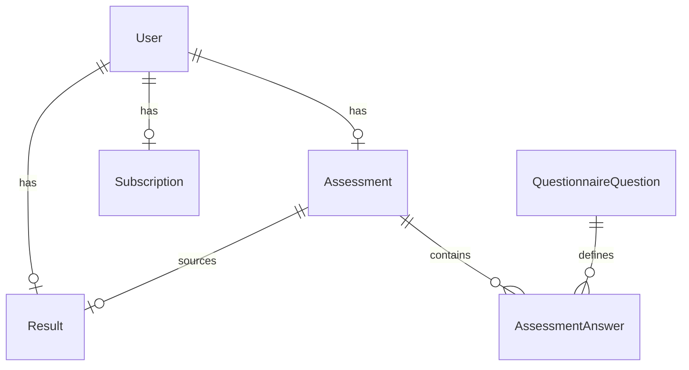

# VitalPath

VitalPath 是一个匿名健康测评 funnel 后端：分步保存与恢复、服务端健康计算、结果版本一致性、模拟订阅和免费/会员字段权限。仓库为独立 Git 项目，当前只完成本地代码与验证，尚未部署。

- GitHub：<https://github.com/Brandoo110/vitalpath>
- 线上 URL：待部署；不存在可引用的线上 session。
- 技术栈：Next.js 16.2.9 App Router、TypeScript、Prisma 7.8、PostgreSQL、Zod 4、Vitest 4。

## 本地运行

复制 `.env.example` 为 `.env`，让 `DATABASE_URL` 和 `DIRECT_URL` 指向同一个本地 PostgreSQL 数据库，然后运行：

```sh
npm ci
npx prisma generate
npx prisma migrate deploy
npm test -- --maxWorkers=1
npm run lint
npm run build
npm run test:http
```

`test:http` 会启动本地 production Next 服务，实际通过 HTTP 跑完整流程，最后只删除本次创建的 session。不要把测试连接到生产数据库。

## 数据模型



`Assessment.version` 是保存和提交的并发门禁；`Result.assessmentId` 与 `sourceAssessmentVersion` 绑定产生它的测评快照。`Subscription.status` 是订阅唯一来源，API 为兼容性仍返回 `subscriptionStatus`。旧结果的来源版本未知时保留 `NULL`，结果接口要求重新提交。

## API

所有写接口使用 JSON；`sessionId` 必须是 UUID。`PATCH /api/assessment` 和 `POST /api/assessment/submit` 都必须携带当前整数 `version`。

### `POST /api/sessions`

请求：`{ "healthDataConsent": true }`（可省略）。响应 `201`：`{ "sessionId": "…", "subscriptionStatus": "free" }`。

### `GET /api/assessment?sessionId=…`

返回保存的核心字段、扩展答案、`step`、`completed` 和当前 `version`。没有测评时返回 `assessment: null, version: 0`。

### `PATCH /api/assessment`

请求示例：

```json
{
  "sessionId": "…",
  "step": 2,
  "version": 1,
  "data": { "weightKg": 72, "targetWeightKg": 62 }
}
```

成功响应包含递增后的 `version`。同一测评行在事务中锁定；旧版本返回 `409 version_conflict`。所有核心字段、扩展答案、同意状态和 `completed=false` 同事务写入。

### `POST /api/assessment/submit`

请求：`{ "sessionId": "…", "version": 2 }`。成功响应：`{ "ok": true, "resultId": "…" }`。服务器在锁定的测评快照上计算，并持久化 `calculatedAt`、`algorithmVersion` 和来源版本。同版本重复提交返回原结果，不刷新日期；版本已变化返回 `409 version_conflict`。

### `GET /api/results?sessionId=…`

响应带 `Cache-Control: private, no-store`。没有结果返回 `409 assessment_not_submitted`；测评修改后旧结果返回 `409 assessment_stale`。免费响应只含 BMI、分类、宽泛热量区间和 plan preview，绝不含精确 `recommendedCalories`、`targetDate` 或完整 `plan`。会员响应由 `Subscription.status=active` 授权。

### `POST /api/pay`

请求：`{ "sessionId": "…", "plan": "monthly" }`，套餐为 `trial`、`monthly` 或 `quarterly`，`plan` 可省略（默认首次支付 `monthly`）。这是模拟支付，不连接 Stripe。

```sh
curl -X POST "$BASE_URL/api/pay" \
  -H 'content-type: application/json' \
  -d '{"sessionId":"YOUR_SESSION_ID","plan":"monthly"}'
```

首次支付写入 `Subscription(status, plan, paidAt)`。相同套餐或省略套餐的重放返回原 `paidAt`；不同套餐返回 `409 plan_conflict`，不会覆盖已有支付状态。

### `PATCH /api/sessions/lead`

请求 `{ "sessionId": "…", "name": "Plan Reader", "email": "reader@example.com" }`，用于结果生成后保存 lead 信息。

## 测试覆盖

Vitest 使用本地 PostgreSQL，当前 `npm test -- --maxWorkers=1` 通过 8 个文件、58 个测试。覆盖算法边界和非有限结果、分步保存/恢复、乱序 step、必传版本、真正并发 PATCH、submit/ PATCH 版本一致性、同版本重复 submit、修改后的 stale 结果、免费字段保护、支付重放与套餐冲突、事务回滚和数据库约束。`npm run test:migration` 会在同一专属 PostgreSQL 实例创建临时库，验证合法旧数据保留/绑定和冲突迁移回滚。`npm run test:http` 通过真实 Next HTTP 服务覆盖创建→增量保存→恢复→submit→免费结果→pay→完整结果。

未覆盖真实登录、真实支付 webhook、生产数据库迁移、压力/长稳、线上部署和临床有效性；这些超出本次模拟挑战授权与范围。

## AI 使用复盘

详见 [AI使用复盘.md](AI使用复盘.md)。本轮记录了竞品数据流、数据库建模、Mock/边界测试、健康算法和支付/事务方案的协作过程，以及一次明确否决 AI 方案的原因。
